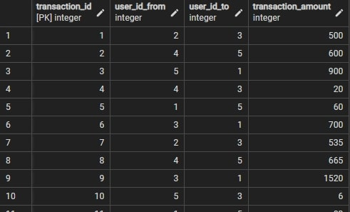

# bankist_app
A full stack Bankist App

@ MOST OF THE HTML-CSS CODES DO NOT BELONG TO ME, ALL CREDITS GOES TO JONAS SCHMEDTMANN

In this project I have designed a banking web application usin vanilla JS in the frontend and Golang-PostgreSQL in the backend.
I have made use of GORM for making the queries easier.
gorilla/mux library is used for routing.
net/http lib is used to handle HTTP requests.

Session cookies are also utilized for authentication purposes -JWT.

Users can login to the system using their usernames and passwords, can loan money, send money to other accounts using the receiver's user_id which is stored in the DB.
All transactions are also stored in the DB, and when the user logs in, they are displayed on the screen.

More detailed explanations will be provided later.
Registration service will be added in the following days.

